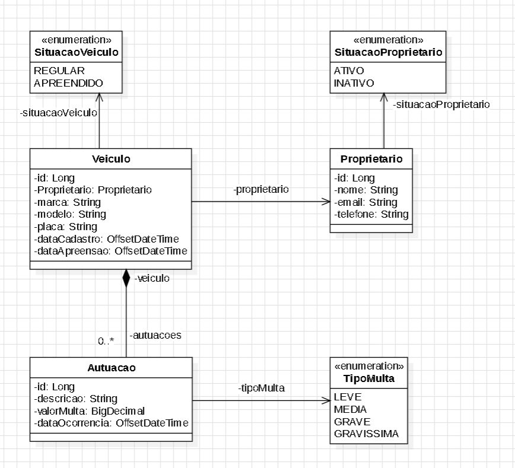

# Autuação de Trânsito - API

# Sobre o projeto

[API em produção no Railway](https://transito-api-production.up.railway.app "App em produção no Railway")

Autuação de Trânsito é uma aplicação back-end inspirada através do curso Ignição Spring Rest
da [AlgaWorks](https://algaworks.com "Site da AlgaWorks").

A aplicação consiste na exposição de uma API REST,
que possibilita toda a gestão de autuações de trânsito.
Os dados são coletados inicialmente pela própria API.

- Cadastro de Proprietário, Veículo e Autuação
- Listagem de Proprietário, Veículo e Autuação
- Busca de Proprietário, Veículo
- Autuação de Veículo
- Ativação/Inativação de Proprietário

## Modelo de domínio Transito API



# Tecnologias utilizadas

## Back end

- Java 17
- Spring Boot
- JPA / Hibernate / Lombok / Flyway
- Maven
- H2
- MySql

## Implantação em produção

- Back end: Railway
- Banco de dados: MySql

# Como executar o projeto

## Back end

Pré-requisitos: Java 17

```bash
# clonar repositório
git clone https://github.com/ricardoguntzell/transito-api

# entrar na pasta do projeto raiz

# executar o projeto
./mvnw spring-boot:run
```

# Autor

Ricardo Guntzell

www.linkedin.com/in/ricardoguntzelljr
